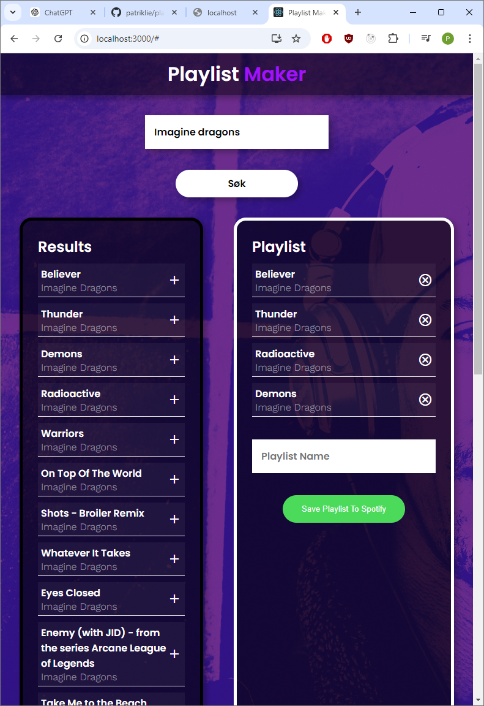

# Playlist Maker

Denne React-applikasjonen lar brukere logge på sin Spotify-konto, søke etter sanger, og lage nye spillelister som lagres på deres Spotify-bruker.

## Funksjonalitet

- **Logg inn på Spotify:** Brukere kan autentisere med sin Spotify-konto.
- **Søk etter sanger:** Søke etter favorittlåter fra Spotifys database.
- **Lag spillelister:** Opprett nye spillelister og lagre dem direkte på din Spotify-bruker.
- **Brukervennlig grensesnitt:** Enkel navigasjon med et rent og responsivt design.
- **Spotify API** Profilbilde og navn på innlogget bruker hentet fra Spotify API.

## Teknologier brukt

- **React:** Grunnsteinen i appens frontend.
- **Axios:** Brukes til å håndtere HTTP-forespørsler mot Spotify API.
- **Spotify API:** For autentisering, søkefunksjonalitet, og oppretting av spillelister.
- **React-scripts:** Forenkler konfigurasjonen og kjøringen av React-applikasjonen.
- **Web Vitals:** For å overvåke og optimalisere appens ytelse.

## Hvordan kjøre prosjektet

1. Klon dette repoet:
    ```bash
    git clone https://github.com/patriklie/playlistmaker.git
    ```
2. Naviger til prosjektmappen og installer avhengighetene:
    ```bash
    cd playlistmakerr
    npm install
    ```
3. Kjør applikasjonen:
    ```bash
    npm start
    ```

## Avhengigheter

- `axios`: ^1.6.2
- `react`: ^18.2.0
- `react-dom`: ^18.2.0
- `react-scripts`: 5.0.1
- `web-vitals`: ^2.1.4

## Skjermbilder av appen


## Fremtidige forbedringer

- Legge til mer avansert feilbehandling for API-forespørsler.
- Implementere funksjonalitet for å redigere og slette spillelister.