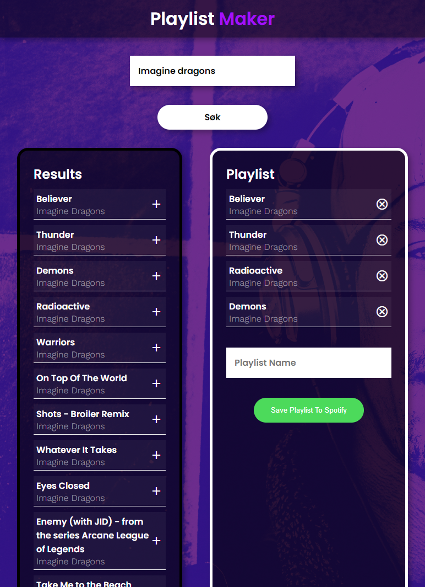

# Playlist Maker

This React application allows users to log in to their Spotify account, search for songs, and create new playlists that are saved directly to their Spotify account.

## Functionality

- **Log in to Spotify:** Users can authenticate using their Spotify account.
- **Search for songs:** Search for favorite tracks from Spotify's database.
- **Create playlists:** Create new playlists and save them directly to your Spotify account.
- **User-friendly interface:** Easy navigation with a clean and responsive design.
- **Spotify API** Profile picture and name of the logged-in user fetched from the Spotify API.

## Technologies Used

- **React:** The foundation of the app's frontend.
- **Axios:** Used to handle HTTP requests to the Spotify API.
- **Spotify API:** For authentication, search functionality, and playlist creation.

## How to Run the Project

1. Clone this repository:
    ```bash
    git clone https://github.com/patriklie/playlistmaker.git
    ```
2. Navigate to the project folder and install the dependencies:
    ```bash
    cd playlistmaker
    npm install
    ```
3. Run the application:
    ```bash
    npm start
    ```

## Dependencies

- `axios`: ^1.6.2
- `react`: ^18.2.0
- `react-dom`: ^18.2.0
- `react-scripts`: 5.0.1
- `web-vitals`: ^2.1.4

## Screenshot of the App


## Future Improvements

- Add more advanced error handling for API requests.
- Implement functionality to edit and delete playlists.
